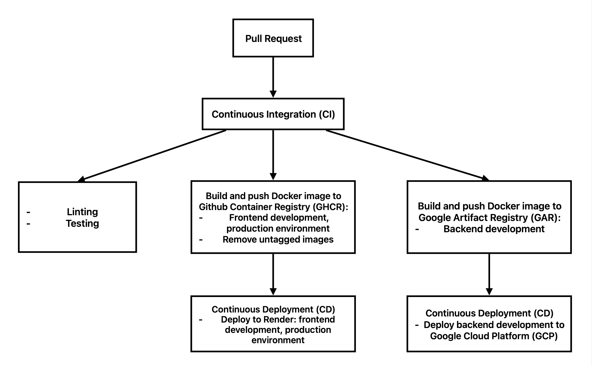

# App CI/CD Pipeline

## CI/CD architecture

Pull request to 'main' branch from 'frontend' or 'backend' branches trigger CI workflow including:
- Code linting:
  - 'Eslint frontend' and 'Eslint backend' workflows are triggered when pull request coming from branch containing 'frontend' and 'backend', respectively
- Running tests
  - Running tests and produce test reports (saved in 'reports/' directory)
  - 'backend tests' and 'frontend tests' workflows are riggered when pull request coming from branch containing 'frontend' and 'backend', respectively
- Build and push image to Github Container Registry
  - Build and push image for frontend development and production environment
  - Tag images with version tag input
  - Schedully remove untagged images at 9:00 every day.
- Build and push image to Google Artifact Registry
  - Build and push image for backend development
  - Tag images with version tag input

Following CI, CD workflows will be automatically triggered including:
- Deploy to Render
  - Frontend development deploy is triggered when workflow for build and push image to GHCR is completed. 
  - Production environment deploy is triggered when workflow for build and push production to GHCR is completed
- Deploy to Google Cloud Platform
  - Backend development deploy is triggered when workflow for build and push image to GAR is completed


## Services and Tools

The following services and tools have been used to build and run CI/CD for this project

| Tool/ Service | Description | Alternatives |
| --- | --- | --- |
| Github Actions | Tool for building CI/CD workflow | Gitlab CI, Jenkins|
| Docker | Container Tool. Used for building images | Virtual Machines, Heroku |
|Github Container Registry (GHCR) | Container Registry tool, used for storing built images | AWS ECR, Docker Hub |
|Google Artifact Registry | Container Registry tool, used for storing built images | GHCR, AWS ECR |
|Render | Cloud hosting platform, used for hosting frontend development and production environment | Fly.io, Heroku, Railway |
|Google Cloud Platform | Cloud hosting platform, used for hosting backend development environment | AWS ECS, Azure App Service |
|Jest | Testing tool for backend Express server | vitest, mocha |
|Vitest | Testing tool for frontend React  | Jest, mocha |
|Eslint | Code linting for project |  |

### Github Actions
GitHub Actions vs GitLab CI 
  - Github Actions: Provide large marketplace ecosystem for this project as it is on Github
	-	GitLab CI: “everything in one” DevOps platform; pipelines + registry + environments integrated. However, since this project is on Github, GitLab CI is not very suitable in this case
  
GitHub Actions vs Jenkins: Github is more suitale in this case because 
  - it runs directly from Github events (PRs, pushes, tags) without webhook or pluggin set up
  - No need to host, maintain, or secure a CI server like Jenkins.
  - Seamless use of GITHUB_TOKEN for Docker builds and GHCR image pushes.
  - CI/CD Pipelines live in project repo and are version-controlled with the code.
  - Jenkins is more flexible for enterprise or on-premise setups, but requires managing servers, plugins, and credentials.

Examples:
A workflow triggered by pull request event on Github Actions
```
name: ESLint Runner

on: [pull_request]

jobs:
  eslinter:
    runs-on: ubuntu-latest
    permissions:
      contents: read
      pull-requests: write
    steps:
      - uses: actions/checkout@v6
      - uses: reviewdog/action-eslint@v1.34.0
        with:
          github_token: ${{ secrets.GITHUB_TOKEN }}
          reporter: github-pr-review
          eslint_flags: "src/"
      - uses: tj-actions/eslint-changed-files@v25.3.2
        with:
          config_path: "./eslint.config.mjs"
```
This workflow will be run automatically for every pull requests made on Github repository, and generate a summary.
### Docker
Docker vs Virtual Machines
	-	VMs ship an entire guest OS per app. Containers share the host kernel, so they’re typically lighter and start faster.  
	-	For a messaging app (API + WebSockets), faster start + less overhead helps when you scale instances up/down and when you run multiple services locally/CI.

Docker vs “buildpacks” (Heroku)
	-	Buildpacks automatically turn source code into an image and abstract the operating system/runtime choices.  
	-	Dockerfiles give explicit control over Operating System packages, Node version, native dependencies, and runtime behavior, which is handy when for dev/staging/prod build and deployment. Docker’s whole pitch is consistent shipping/testing/deploying across environments.
### GHCR
GHCR is more suitable to deploy frontend development and production because:
	-	Native GitHub integration: Works directly with GitHub Actions using GITHUB_TOKEN (no extra IAM setup).
	-	Simpler auth: No need to manage separate registry credentials or cloud service accounts.
	-	Repo-linked permissions: Access to images matches your GitHub repo permissions.
	-	Versioned Docker images: Enables reliable deploys and easy rollbacks (important for stable WebSocket backends).
Compared to alternatives:
	- Docker Hub: Requires separate login/PATs and has pull rate limits.
	-	AWS ECR: More setup (IAM, tokens), better for full cloud-native enterprise stacks but overkill for most GitHub to Render pipelines.
### Google Artifact Registry (GAR)
For deploying backend developemt to GCP, GAR is the more suitable option compared to AWS ECR and GHCR:
- GAR integrates directly with GCP services (Cloud Run), while GHCR doesn't and requires remote directory connection setup. 
- Simple and easy to understand UI
- Secure, IAM-controller image access
- Seamless deploy to Cloud Run (no extra login steps)


### Jest
Jest is used for mainly testing framework with a fast and reliable integration testing with built in mocking options, suitable for Express server. 

### Vitest
Vitest is chosen for this messaging app because it integrates seamlessly with Vite, offering a testing environment that matches the app’s actual development setup for faster, more accurate test execution. Vitest provides lightning-fast test runs, built-in mocking, and instant hot reloading—mirroring Vite’s performance advantages. Compared to Jest, which is powerful but slower and requires additional configuration to work smoothly with Vite projects, Vitest feels simpler and more native. Mocha, while flexible, requires more manual setup for assertions, mocking, and DOM simulation, making it less convenient for testing modern frontend apps. Vitest delivers a faster, more consistent, and more developer-friendly testing experience, making it the most suitable choice for a Vite-powered messaging app.

### Render
Render is a managed PaaS that runs long-lived backend services easily.
	- Supports Docker deploys, autoscaling, HTTPS, and environment configs.
	- Simpler setup than Fly.io (less infra tuning) and more modern than Heroku.
	- Railway is similar but usage-based billing can spike with persistent WebSocket traffic.
  - Free-tier available

For the scale of this project, Render is more suitable for production deploy because it provides stable, always-on instances ideal for messaging apps that rely on persistent WebSocket connections and background jobs, with minimal infrastructure management.

### GCP
CP Cloud Run runs containerised backends serverlessly with automatic scaling.
	-	Deep integration with Artifact Registry and IAM improves security and deployment consistency.
	- Easier container deploy flow than AWS ECS (less networking/IAM complexity).
  - Easy-to-understand UI than EWS ECS

GCP is more suitable for backend deploy because it enables containerized Node APIs to scale automatically under chat traffic spikes while maintaining secure, cloud-native deployment and low operational overhead.

CI/CD system used various third-party Github Actions, as following:

| Actions | Usage Description | Link |
| --- | --- | --- |
|  Checkout | Code checkout | [Link](https://github.com/marketplace/actions/checkout) |
| Publish Test Results | Publish test results on Github and saved in specified folder | [Link](https://github.com/marketplace/actions/publish-test-results) |
| Run eslint with reviewdog | Run code linting | [Link](https://github.com/marketplace/actions/run-eslint-with-reviewdog) |
| Changed Files | Track all changed files and directories relative to a target branch, the current branch for code linting | [Link](https://github.com/marketplace/actions/changed-files) |
| Deploy a Docker image to Render platform | Deploy frontend development and production to Render  | [Link](https://github.com/marketplace/actions/deploy-a-docker-image-to-render-platform) |
| Build and push Docker images | Build and push frontend development and production images to GHCR | [Link](https://github.com/marketplace/actions/build-and-push-docker-images) |
| Authenticate to Google Cloud | authentication to Google Cloud | [Link](https://github.com/marketplace/actions/authenticate-to-google-cloud) |
| Set up gcloud Cloud SDK environment | Configures the Google Cloud SDK in the GitHub Actions environment, for build and push image to GAR | [Link](https://github.com/marketplace/actions/set-up-gcloud-cloud-sdk-environment) |
| Docker Setup Buildx | Setup Docker Buildx for build and push image action | [Link](https://github.com/marketplace/actions/docker-setup-buildx) |
| Deploy to Cloud Run | Deploy backend development to Google Cloud Run | [Link](https://github.com/marketplace/actions/deploy-to-cloud-run) |
