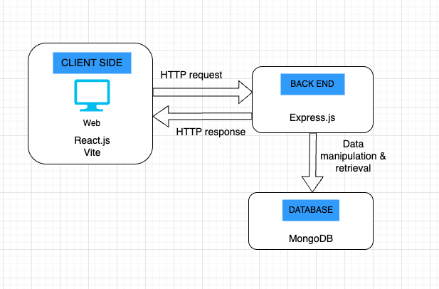
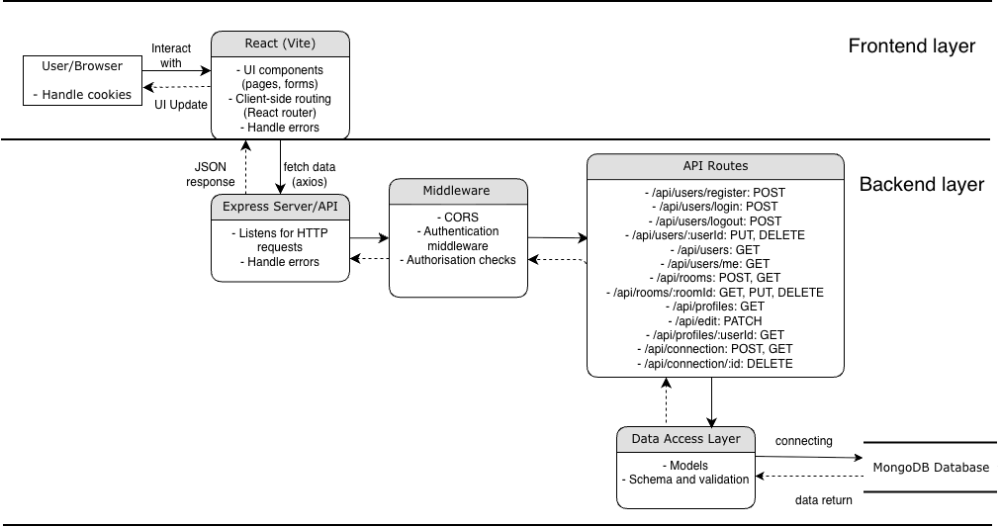

# App containerisation

## Application Architecture

### App Architecture


This app includes 3 main parts:
- Client side: with user interface, where client interact with user interface to send request to backend. Client will also receive response from Backend and show relevant UI. Client side will be built with React + Vite. 
- Backend: Backend using Express.js server, establishing a server to receive request from Client side. Once request is received, the server then perform data manipulation or retrieval to the database. Once requests are resolved, server will send responses to client side. 
- Database: MongoDB is selected for app database. Database acts as a storage for all app data. Data is created and manipulated by backend server request. 

Detailed app architecture diagram:



**Client Side (React + Vite):**

The client side is a browser-based user interface built with React and bundled with Vite. It renders pages and components, collects user input, manages UI state (loading, errors, cached data), and handles navigation via routing. When the user performs an action (such as registering, logging in, creating new connection, or requesting data), the frontend calls the backend using axios. The client receives JSON responses from the backend and updates the UI accordingly. 

**Backend (Express.js API Server):**

The backend is an Express.js server responsible for receiving HTTP requests from the client, validating inputs, enforcing authentication and authorization rules, and executing logic. Requests pass through middleware (CORS, JSON parsing,  authentication checks, authorisation for request to controllers) before reaching route handlers. Controllers coordinate each request by calling a data access layer (Mongoose models) to read and write data. The backend returns structured JSON responses with appropriate HTTP status codes, ensuring consistent success and error handling and preventing the client from accessing the database directly. Authentication is handled in backend using Jwt token saved in response cookie (HttpOnly), preventing unauthenticated and unauthorised users to access or manipulate data. With token being handled completely in Backend, it is more secured, preventing token from being exposed on client side. 

**Database (MongoDB):**

MongoDB is used as the persistent data store for the application. It stores application data in collections (such as users, profiles) and relies on indexes for query performance and uniqueness constraints (e.g., unique email). Data is only created, read, updated, and deleted through the backend server. 

Below is diagram showing authentication and authorisation workflow used in this app:
.png)
The diagram illustrates a JWT-based authentication and authorization flow designed for this app. A user begins by submitting login credentials, which the backend verifies against stored user data. If authentication fails, the process ends and access is denied. If authentication succeeds, the server issues a JWT and stores it in a secure httpOnly cookie, which the browser automatically includes in all subsequent requests. For each request to protected API endpoint, the backend checks the cookie, validate the JWT by checking if Jwt is in Blacklist, decoding Jwt and verify with users in the database. If this succeed, the backend will continue to determine whether the request is authorized. If the token is successfully validated and requests are authorised, the request proceeds and the backend returns the requested data; if not, the request is rejected and the flow terminates.

When user logout, cookie will be cleared and current Jwt token will be saved in a Blacklist collection in database. This is where Jwt in request cookie will be checked againist to ensure that logout users are not authenticated and authorised for any requests to protected endpoint. 


### Containerisation Architecture

The app is containerised into development, testing and production environments. 

- Backend
  - Development environment: this environment is built from all files in /Backend folder. 

    Inside the ```/Backend``` directory:
    the image is built by running following command:
    ````bash 
    docker build --target development --tag backend-app-dev:v1 .
    ````

    Run the container:
    ````bash
    docker compose up app-dev --build
    ````

    Backend api will then be available at "http://localhost:3000"

  - Tesing environment:

    Inside the ```/Backend``` directory:
    Build the image:

    ````bash 
    docker build --target test --tag backend-app-test:v1 .
    ````

    Run the container:
    ````bash
    docker run -it backend-app-test:v1
    ````

  - Production environment: production enviroment for the app is built in "Backend" folder only. This enviroment combines essential frontend and backend files and depedencies for production.

    To build and run this enviroment, inside the ```/MERN-PROJECT``` directory:

    Build image:
    ````bash 
    docker build -f ./Backend/Dockerfile --target production --tag fullstack-app-prod:v1 .
    ````

    Run the container:
    ````bash
    docker compose -f ./Backend/docker-compose.yaml up app-prod
    ````

    Production app will then be available at: "http://localhost:3000" 

- Frontend: frontend containes development and testing environment only
  - Development environment: this environment is built from all files in /Frontend folder.
    
    Inside the ```/Frontend``` directory:
    Build image:
    ````bash 
    docker build --target development --tag frontend-app-dev:v1 .
    ````

    Run the container:
    ````bash
    docker compose up app-dev --build
    ````

  - Tesing environment:

    Inside the ```/Frontend``` directory:
    Build the image:

    ````bash 
    docker build --target test --tag frontend-app-test:v1 .
    ````

    Run the container:
    ````bash
    docker run -it frontend-app-test:v1
    ````

## Container Usage Guide

The app container is avaible on AWS ECR private repository. Please contact me if you wish to get access to the docker container for contribution. AWS account is required. 

When you get permission to my repository, follow below step to pull images from the repo:

Step 1: create IAM user with access key, following instruction in https://medium.com/@mudasirhaji/how-to-create-an-aws-iam-user-a-step-by-step-guide-39d2a07a1670

Step 2: Configure aws CLI on your laptop
````bash
aws configure
````
Then enter:
- Access Key ID
- Secret Access Key
- Region: ap-southeast-2
- Output: json

Step 3: Retrieve an authentication token and authenticate your Docker client to the container registry
````bash
aws ecr get-login-password --region ap-southeast-2 | docker login --username AWS --password-stdin 163467641569.dkr.ecr.ap-southeast-2.amazonaws.com
````

Step 4: Pull images
```bash
docker pull 163467641569.dkr.ecr.ap-southeast-2.amazonaws.com/message-app:latest
````